# Refactoring Timeline - Visual Roadmap

**Last Updated**: November 7, 2025

---

## 📅 Gantt Chart Overview

```mermaid
gantt
    title Refactoring Project Timeline (Nov 2025 - May 2026)
    dateFormat  YYYY-MM-DD

    section RDB-002: Testing
    Week 1: Foundation           :done,    w1, 2025-11-04, 5d
    Week 2: Contracts            :active,  w2, 2025-11-11, 5d
    Week 3-4: Integration        :         w34, 2025-11-18, 10d
    Week 5: Test Factories       :         w5, 2025-12-09, 5d
    Week 6-12: Bulk Testing      :         w612, 2025-12-16, 35d
    Week 13-16: E2E Tests        :         w1316, 2026-02-10, 20d
    Week 17-20: Chaos Eng        :         w1720, 2026-03-09, 20d
    Week 21-24: Production       :         w2124, 2026-03-30, 20d

    section RDB-004: Refactoring
    Task 1: Analysis             :done,    t1, 2025-11-07, 1d
    Task 6: Pre-Work             :done,    t6p, 2025-11-03, 4d
    Integration Phase            :crit,    int, 2025-11-11, 5d
    Task 2: TypeCode             :         t2, after int, 5d
    Task 3: Accessors            :         t3, after t2, 7d
    Task 4: CDR                  :         t4, after t3, 5d
    Task 5: Utilities            :         t5, after t4, 4d
    Task 6: Coverage             :         t6, after t5, 1.5d
    Task 7: Security             :         t7, after t6, 2d
    Task 8: Deploy               :milestone, t8, after t7, 2d

    section Critical Milestones
    Week 1 Complete              :milestone, m1, 2025-11-08, 0d
    Integration Complete         :milestone, m2, 2025-11-15, 0d
    Week 4 Complete              :milestone, m3, 2025-12-06, 0d
    All Modules Extracted        :milestone, m4, 2025-12-13, 0d
    Refactor Complete            :milestone, m5, 2025-12-20, 0d
    60% Coverage                 :milestone, m6, 2026-02-07, 0d
    Production Ready             :milestone, m7, 2026-04-24, 0d
```

---

## 📊 Track 1: Testing Infrastructure (24 Weeks)

```mermaid
gantt
    title RDB-002: Testing Infrastructure Modernization
    dateFormat  YYYY-MM-DD

    section Phase 1: Foundation (Weeks 1-4)
    Week 1: Frameworks, CI/CD, Mutation     :done,    2025-11-04, 5d
    Week 2: Pact Broker, Contracts          :active,  2025-11-11, 5d
    Week 3: Contract Expansion              :         2025-11-18, 5d
    Week 4: TestContainers, Integration     :         2025-11-25, 5d

    section Phase 2: Scale (Weeks 5-12)
    Week 5: Test Data Factories             :         2025-12-09, 5d
    Week 6-7: Bulk Unit Tests (60%)         :         2025-12-16, 10d
    Week 8-9: More Unit Tests (70%)         :         2025-12-30, 10d
    Week 10: Visual/A11y Testing            :         2026-01-13, 5d
    Week 11-12: Performance, Optimization   :         2026-01-20, 10d

    section Phase 3: Advanced (Weeks 13-24)
    Week 13-16: E2E with Playwright         :         2026-02-10, 20d
    Week 17-20: Chaos Engineering           :         2026-03-09, 20d
    Week 21-24: Observability, DORA         :         2026-03-30, 20d
```

---

## 🏗️ Track 2: PolyORB Refactoring (8 Tasks)


---

## 🎯 Critical Path Analysis

```mermaid
graph LR
    A[Task 6 Pre-Work<br/>COMPLETE ✅] --> B[Integration Phase<br/>5 days<br/>🔴 BLOCKER]
    B --> C[Task 2: TypeCode<br/>5 days]
    C --> D[Task 3: Accessors<br/>7 days]
    D --> E[Task 4: CDR<br/>5 days]
    E --> F[Task 5: Utilities<br/>4 days]
    F --> G[Task 6: Coverage<br/>1.5 days]
    G --> H[Task 7: Security<br/>2 days]
    H --> I[Task 8: Deploy<br/>2 days<br/>🎉 COMPLETE]

    style A fill:#90EE90
    style B fill:#FF6B6B
    style I fill:#FFD700
```



---

## 🔄 Parallel Work Streams

```mermaid
graph TB
    subgraph "Week 1-2 (Nov 4-15)"
        W1[RDB-002 Week 1<br/>COMPLETE ✅]
        W2[RDB-002 Week 2<br/>In Progress 🔄]
        INT[Integration Phase<br/>Starting 📋]
    end

    subgraph "Week 3-4 (Nov 18 - Dec 6)"
        W3[RDB-002 Week 3<br/>Contract Tests]
        W4[RDB-002 Week 4<br/>TestContainers]
        T2[Task 2: TypeCode]
        T3[Task 3: Accessors]
    end

    subgraph "Week 5+ (Dec 9+)"
        W5[RDB-002 Weeks 5-12<br/>Bulk Testing]
        T4[Task 4: CDR]
        T5[Task 5: Utilities]
        T6[Task 6-8: Validation]
    end

    W1 --> W2
    W2 --> W3
    W3 --> W4
    W4 --> W5

    INT --> T2
    T2 --> T3
    T3 --> T4
    T4 --> T5
    T5 --> T6

    style W1 fill:#90EE90
    style W2 fill:#87CEEB
    style INT fill:#FFD700
```



---

## 📈 Progress Tracking

### Overall Completion

```
RDB-002: Testing Infrastructure
████░░░░░░░░░░░░░░░░░░░░ 4% (Week 1/24)

RDB-004: PolyORB Refactoring
██████████░░░░░░░░░░░░░░ 25% (2/8 tasks complete)

Combined Progress: 14.5%
```

### Detailed Breakdown

| Track | Phase | Status | Progress | Next Milestone |
|-------|-------|--------|----------|----------------|
| RDB-002 | Phase 1 | 🔄 In Progress | 25% (1/4 weeks) | Week 4 complete (Dec 6) |
| RDB-002 | Phase 2 | 📋 Planned | 0% (0/8 weeks) | Week 12 complete (Feb 7) |
| RDB-002 | Phase 3 | 📋 Planned | 0% (0/12 weeks) | Week 24 complete (Apr 24) |
| RDB-004 | Prep | ✅ Complete | 100% (2/2 tasks) | Integration done (Nov 15) |
| RDB-004 | Extract | ❌ Blocked | 0% (0/4 tasks) | All modules done (Dec 13) |
| RDB-004 | Validate | ⏳ Ready | 0% (0/3 tasks) | Deploy complete (Dec 20) |

---

## 🚦 Status Legend

| Symbol | Meaning | Action Required |
|--------|---------|-----------------|
| ✅ | Complete | None - celebrate! |
| 🔄 | In Progress | Continue work |
| 📋 | Planned | No action yet |
| ⏳ | Ready | Awaiting dependencies |
| ❌ | Blocked | Unblock immediately |
| 🔴 | Critical Blocker | P0 - Escalate |
| 🟡 | At Risk | Monitor closely |
| 🟢 | On Track | Continue as planned |

---

## 📅 Key Dates

### November 2025
- **Nov 8**: Week 1 complete ✅
- **Nov 11-15**: Integration Phase + Week 2
- **Nov 18-22**: Task 2 starts + Week 3
- **Nov 25-29**: Task 3 in progress + Week 4

### December 2025
- **Dec 2-6**: Task 3 complete, Task 4 starts
- **Dec 9-13**: Task 5 complete, all modules extracted 🎉
- **Dec 16-20**: Tasks 6-8, refactor deployed 🚀
- **Dec 23-27**: Holiday break, Week 6 reduced capacity

### January-April 2026
- **Jan 13**: Week 10 - Visual/A11y testing
- **Feb 7**: Week 12 - 80% coverage achieved 🎯
- **Feb 10**: Week 13 - E2E testing starts
- **Mar 9**: Week 17 - Chaos engineering starts
- **Apr 24**: Week 24 - Production ready! 🎉

---

## 📊 Metrics Dashboard

### Current Week Metrics (Week 2)

| Metric | Week 1 | Week 2 Target | Status |
|--------|--------|---------------|--------|
| Tests Written | 75 | +30 | 📋 Pending |
| Coverage | 95% (local) | 95% | ✅ On track |
| CI/CD Runtime | 4 min | <4 min | ✅ Optimized |
| Mutation Score | 97% | >90% | ✅ Exceeds |

### Refactoring Progress

| Metric | Current | Week 2 Target | Final Target |
|--------|---------|---------------|--------------|
| Modules Extracted | 0/5 | 0/5 | 5/5 |
| LOC Remaining | 4,302 | 4,302 | ~800 |
| Test Coverage | 62% | 80% (new tests) | 80%+ |
| Performance Delta | N/A | N/A | ≤5% |

---

## 🔗 Quick Links

**Planning Documents**:
- [Full Roadmap](./SHARED-REFACTORING-ROADMAP.md) - Complete 50+ page roadmap
- [Executive Summary](./ROADMAP-EXECUTIVE-SUMMARY.md) - One-page overview
- [This Timeline](./ROADMAP-TIMELINE.md) - Visual Gantt charts

**Execution Reports**:
- [Week 1 Complete](./EXECUTION-COMPLETE.md) - Week 1 results
- [Task 6 Pre-Work](./improvements/PREWORK-COMPLETION-REPORT.md) - Pre-work results
- [Task 1 Review](./TASK1-REVIEW-TEST-STABILIZE.md) - Dependency analysis review

**Guides**:
- [CI/CD Setup](./CI-CD-SETUP-GUIDE.md) - Pipeline configuration
- [Week 1 Execution Plan](./WEEK-1-EXECUTION-PLAN.md) - Week 1 tasks
- [Strategic Pre-Work](./TASK6-STRATEGIC-PREWORK-PLAN.md) - Task 6 rationale

---

## 📞 Weekly Sync Schedule

**Mondays 9:00 AM**: Sprint Planning
**Daily 9:00 AM**: 15-min Standup
**Wednesdays 3:00 PM**: Mid-week Checkpoint
**Fridays 2:00 PM**: Retrospective + Demo

**Slack**: #testing-infrastructure-modernization

---

*This timeline is updated weekly. Gantt charts regenerated every Friday.*

**Last Update**: November 7, 2025
**Next Update**: November 14, 2025
**Owner**: @test_stabilize
